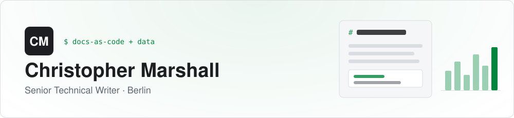
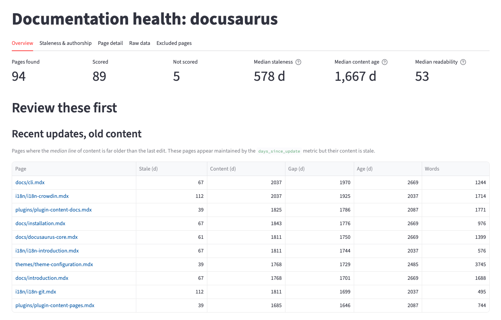

<picture>
  <source media="(prefers-color-scheme: dark)" srcset="assets/header-dark.svg">
  
</picture>

  
  
  
  

I'm a technical writer with 10 years of experience in docs-as-code (Markdown, Git, CI/CD) and the [Diátaxis](https://diataxis.fr/) framework. I use SQL and Python to measure reader value, find what is missing, and know where to spend time improving documetation.

## Featured: dochealth

<a href="https://dochealth.streamlit.app/">
  <picture>
    <source media="(prefers-color-scheme: dark)" srcset="assets/dochealth-dashboard-dark.png">
    
  </picture>
</a>

**dochealth** is a Python tool and Streamlit dashboard that measures the health of any docs-as-code repo. It reads git history and Markdown to provide a page-by-page report on the following:

- **Freshness**: days since last content change, median line age
- **Readability**: Flesch reading ease, word count, code density
- **Structure**: headings and internal links
- **Ownership**: authors and commit counts

The screenshot shows the output from a run over Docusaurus's own docs. It surfaces pages that look maintained but aren't: each was edited in the last four months, yet the median line is more than four and a half years old.

[**Live dashboard →**](https://dochealth.streamlit.app/) &nbsp;·&nbsp; [Case study →](https://christopher-marshall.github.io/docs/projects/dochealth) &nbsp;·&nbsp; [Repo →](https://github.com/christopher-marshall/dochealth)

## Selected documentation work

| Project | What I did |
|---|---|
| [**Shoreline**](https://christopher-marshall.github.io/docs/projects/shoreline) | Migrated 200+ pages from Freshdesk to Docusaurus in under 12 months, restructuring the content along Diátaxis lines. Cut onboarding time from weeks to hours. |
| [**super.AI**](https://christopher-marshall.github.io/docs/projects/superai) | Wrote ML data-platform docs from scratch: 100 pages, including an API reference covering 30 endpoints, video guides, concept pages, and getting started guides. |
| [**Adjust Help Center**](https://christopher-marshall.github.io/docs/projects/adjust-help-center) | Built the client-facing help center in Salesforce and the style standards behind it. |
| [**Adjust features**](https://christopher-marshall.github.io/docs/projects/adjust-new-features) | Documented 10 major and 50+ minor releases, plus UI copy. |

## Toolkit

**Docs**&nbsp;

**Workflow**&nbsp;

**Data**&nbsp;

## Off the clock

Reading philosophy, poetry, and novels · fingerstyle acoustic guitar in the John Fahey vein · running (one marathon so far)

